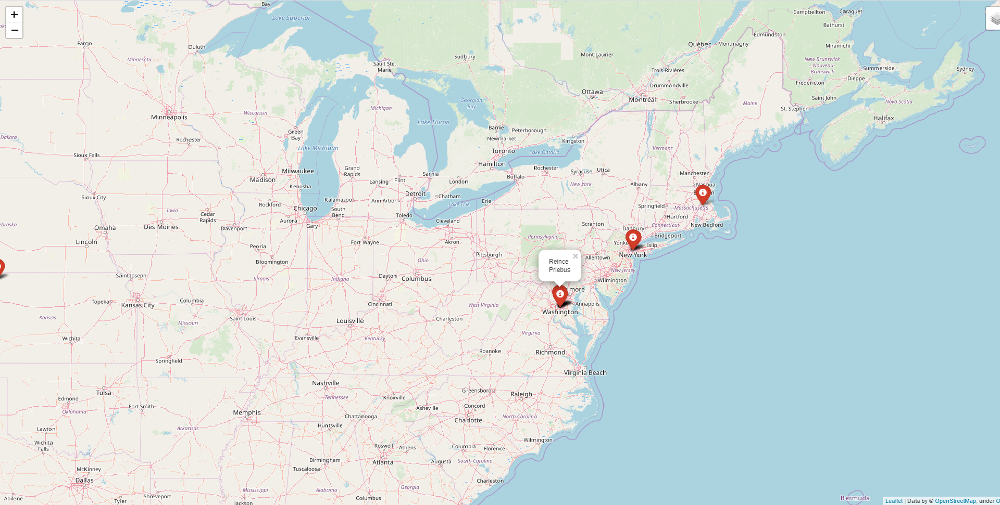

# Twitter Friend Map
This code allows user to enter the Twitter name of a person and see his/her friends' location(if the location in their profile is correct or mentioned)
on the created html map(locations are marked with red markers and can be disabled).

Example Program Call:

Enter Twitter Account: realdonaldtrump

